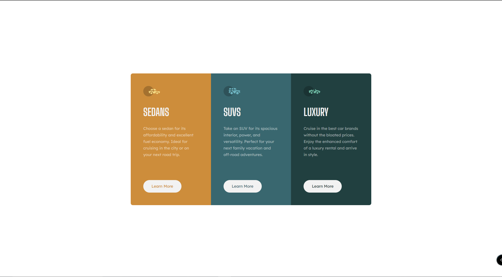

# Frontend Mentor - 3-column preview card component solution

This is my particular solution to the [3-column preview card component challenge on Frontend Mentor](https://www.frontendmentor.io/challenges/3column-preview-card-component-pH92eAR2-).  

## Table of contents

- [Overview](#overview)
  - [The challenge](#the-challenge)
  - [Screenshot](#screenshot)
  - [Links](#links)
- [My process](#my-process)
  - [Built with](#built-with)
  - [What I learned](#what-i-learned)
  - [Continued development](#continued-development)
  - [Useful resources](#useful-resources)
- [Author](#author)

## Overview

### The challenge

Users should be able to:

- View the optimal layout depending on their device's screen size
- See hover states for interactive elements

### Screenshot

Check out the repository for screenshots of the project for screens < 375px.

### Links

- Solution URL: [GitHub Repository](https://github.com/jguleserian/FMC-3-Column-Preview-Card-Component.git)
- Live Site URL: [GitHub Site](https://jguleserian.github.io/FMC-3-Column-Preview-Card-Component/)

## My process

### Built with

- Semantic HTML5 markup
- CSS custom properties
- Flexbox
- CSS Grid
- Mobile-first workflow
- Figma
- Visual Studio Code

### What I learned

My objective in taking on this as my third project was to see how quickly I could complete the project. In essence, this was supposed to be my first time-pressured test for completing the project. Unfortunately, I had a couple of hurdles that cost me a couple of hours. The first of these was the use of a new plugin for Visual Studio Code that allows me to use Edge right in the same window. Unfortunately, unlike just using the separate browser, the page does not refresh automatically. There is probably a setting I need to change, but as you can imagine, I suffered a bit of frustration thinking my styles.css sheet was not linking properly, instead of the real issue - my ignorance!

The second issue I faced was placing my CSS setting for the box-sizing in my <html> element, instead of my universal selector, *. Predictably, this cost me time wondering why I could not get sections in the mobile version of my project to be the correct height.

### Continued development

As I explained in the previous document, I had a couple of frustrations that cost me some time. However, I see these as opportunities to learn a couple of valuable lesons. These couple hours of investment, in reality, pave a smoother road ahead to mastery and professionalism.

Nevertheless, my next few steps in development include:
1. Another simple timed challenge (to see if I can accomplish it with less frustration)
2. Taking on a more complicated challenge
3. Adding a project with JavaScript to incorporate both JS and JQuery.

### Useful resources

No additional resources were used in this project, other than a review of the box-sizing property through www.w3schools.com.

## Author

Jeff Guleserian
- GitHub - [@jguleserian](https://github.com/jguleserian)
- Frontend Mentor - [@jguleserian](https://www.frontendmentor.io/profile/jguleserian)
- LinkedIn - [@jeffguleserian](https://www.twitter.com/yourusername)
